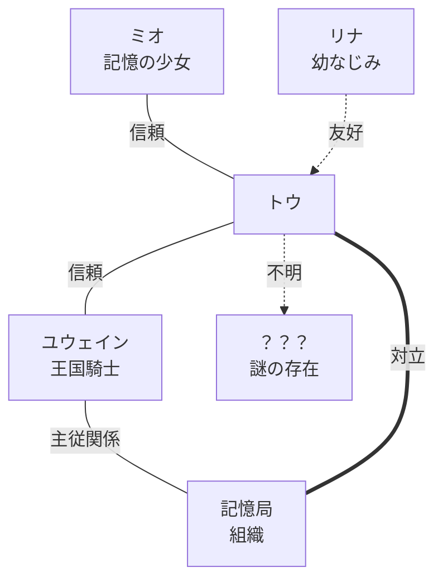

# RewriteMemory 画面モード定義まとめ（v1.2）

> すべての画面は定義済みモードに属し、自由に新しい画面を作らない。
> UI は必要な時だけ現れ、通常時はプレイヤーが世界を見ることを優先する。

**原則：常時ボタンを基本禁止する。UI は必要になった時だけ現れる。**

- バージョン: v1.2
- 種別: 設計ドキュメント（実装・挙動には影響しない）
- 出典: 「RewriteMemory 画面モード定義まとめ（v1.1）」ボードを文章化したもの

---

## 概要

RewriteMemory のすべての画面は、ここで定義された **モード（M00〜M13）** のいずれかに属する。
新しい画面を場当たり的に作らず、既存モードの組み合わせで体験を構成する。

UI は常時表示せず、必要になった時にだけ現れる。プレイヤーが「画面を見る」のではなく
「世界を見る」状態を最優先する。

### ゲームループ（v1.2 確定）
- 通常：`Map(M02) → M03 Talk Window → Map`
- 重要：`Map(M02) → M04 VN Overlay → Map`

---

## モード一覧（M00〜M13）

### M00 タイトル / ブートモード
- **画面例**: `RewriteMemory` ロゴ／`NEW GAME`・`CONTINUE`・`LOAD`・`CONFIG`・`EXIT`
- **用途**: タイトル、ロード、設定などの入口
- **特徴**: 静かな演出、世界観の導入

### M01 VN モード（会話向き）【廃止 → M04 に統合】
- **状態**: v1.2 で廃止。旧用途（長い本編会話・章イベント・重要会話）は M04 VN Overlay が引き継ぐ。
- **理由**: VN を「重要イベント専用の1系統（M04）」に集約し、通常会話（M03 Talk Window）と責務を分離するため。
- **参照**: 既存ドキュメントで M01 を指す箇所は M04 に読み替える。

### M02 探索モード
- **用途**: 移動、調査、自由行動
- **特徴**: UI 非表示、微発光で誘導、世界に没入

### M03 Talk Window モード（通常会話専用）
- **用途**: 探索中の通常会話（NPC会話・調査・独り言・システム通知・選択肢）
- **形式**: 下部会話枠＋顔アイコン（PortraitSmall）。立ち絵は使わない。画面を大きく塞がず、探索の世界をそのまま見せる（地続き感を最優先）。
- **サブモード**:
  - **M03A 通常会話**: PortraitSmall（顔アイコン）・名前あり・探索画面を保持【標準】
  - **M03C 独り言 / M03D システム通知**: 顔アイコンなし・名前なし
  - **M03E 選択肢**: ChoiceList
- **責務分離**: M03＝通常会話（顔アイコン）。重要イベント・立ち絵会話は M04 が扱う。
- **注**: 旧 M03B（立ち絵イベント会話）は M04 VN Overlay へ移管。
- **画面仕様**: docs/design/UIUX/SCREEN/SCREEN_TALK_WINDOW.md

### M04 VN Overlay モード（重要イベント専用）
- **セリフ例**: ミオ「……もう、思い出せないの。」
- **用途**: 重要イベント全般 — 記憶断片・白層化・章ラスト・ボス前後・感情が大きく動く重要会話（旧 M01 の用途、旧 M03B の立ち絵会話を含む）
- **形式**: 暗幕＋エフェクト＋立ち絵＋会話枠。背景（探索Map）は完全に消さず、暗幕で沈めて残す。
- **呼び出し**: 必ず Map 上のイベントから開始し、終了後は Map（同じ位置・向き）へ復帰する。
- **立ち絵が無い場合**: テキストのみで進行（壊れない）。
- **画面仕様**: docs/design/UIUX/SCREEN/SCREEN_VN_OVERLAY.md

### M05 バトルモード（通常戦闘）
- **セリフ例**: 「その記憶は、君を滅ぼすだけだよ。」
- **HP 表示例**: `HP 20/20`
- **コマンド**: たたかう／こうどう／記憶を見る／みのがす
- **用途**: 通常戦闘、回避、行動選択
- **特徴**: HP・コマンド表示、戦闘専用 UI

### M06 バトル会話モード（会話・説得）
- **セリフ例**: 「その記憶は、君を滅ぼすだけだよ。」
- **コマンド**: ＊説得する／＊影をのがす／♥記憶を見る／＊何もしない
- **用途**: 敵との会話、説得、記憶提示、見透す
- **特徴**: バトル中に会話枠が出現、選択肢 2〜4 個

### M07 選択肢モード
- **問いかけ例**: 「どう返答する？」
  - 優しく諭す
  - きっぱり断る
  - 黙って見つめる
- **用途**: 会話分岐、判断、選択
- **特徴**: 選択肢 2〜4 個（基本は 3 個）

### M08 メニューモード
- **項目**: アイテム／装備／スキル／設定／操作説明／タイトルへ戻る
- **用途**: アイテム、設定、操作説明など
- **特徴**: 一時停止中のみ表示

### M09 セーブロードモード
- **スロット例**:
  - `01 第1章・学園・廊下　02:15:34　2025/05/20 12:30`
  - `02 第1章・保健室　　　01:08:21　2025/05/20 14:12`
  - `03 第1章・図書室　　　00:45:18　2025/05/20 16:40`
  - `04 空きスロット`
- **用途**: セーブ、ロード、スロット管理
- **特徴**: 章・場所・時間、サムネイル表示

### M10 演出専用モード
- **用途**: 白層化、夢、回想、真相演出など
- **特徴**: UI なし、エフェクト中心

### M11 遷移中モード
- **表示例**: `Loading...`
- **用途**: フェード、ローディング、画面切替中
- **特徴**: 入力ロック、シンプル表示

### M12 記録 / バックログモード
- **タブ**: バックログ／記憶断片／人物／用語集／相関図
- **バックログ例**:
  - トウ：この違和感、ずっと前からあった気がするんだ。
  - ミオ：……もう、思い出せないの。
  - ？？？：お前の記憶…… 私に見せてみろ。
- **用途**: バックログ、記憶断片、人物情報、用語集
- **特徴**: プレイヤーの記録と理解を可視化するモード
- 相関図の詳細は後述の「M12 相関図（人物相関図）」を参照。

### M13 対話モード（複数人会話）
- **セリフ例**:
  - ミオ：……本当に大丈夫？
  - トウ：ああ、やるしかない。
  - ？？？：彼を信じるべきだ。
  - リナ：でも、危険かもしれないよ。
- **用途**: 2 人以上の会話、仲間との掛け合い
- **特徴**: 話者が交互に表示、アイコン切替

---

## M12 相関図（人物相関図）

M12 の「相関図」タブで表示される、人物・組織の関係マップ。

### ノード（登場人物・組織）
- **トウ**（中心）
- **ミオ**（記憶の少女）
- **リナ**（幼なじみ）
- **ユウェイン**（王国騎士）
- **記憶局**（組織）
- **？？？**（謎の存在）

### 凡例（関係線の種類）
| 関係 | 線種 |
| :-- | :-- |
| 信頼 | 実線（青） |
| 友好 | 破線（緑） |
| 対立 | 実線（赤） |
| 不明 | 破線（灰） |
| 主従関係 | 実線（橙） |

### 関係図（ボードの読み取りに基づく近似）



> 注: 上図はボード（v1.1）の相関図を文章化した近似表現。各関係線の種別は
> 「相関図ルール」のとおり “その時点の現在の認識” を表し、後述のとおり変化しうる。

### 相関図ルール
- プレイヤーが知った情報のみ表示
- 未確定は「？」で表示
- 関係はプレイヤーの認識に応じて変化
- 嘘の関係も、その時点の “現在の認識” として扱う
- 真相判明後に線や説明が変化する

---

## StateMachine（モード遷移と入力制御）

各画面はモードを状態とする有限状態機械（StateMachine）として遷移する。
新しい画面を自由に追加せず、定義済みモード間の遷移として体験を表現する。

### 代表的な遷移
- M00 タイトル → M02 探索 / M01 VN（ニューゲーム・コンティニュー）
- M02 探索 → M03 探索会話 / M04 VN オーバーレイ（オブジェクト・NPC への接近と決定）
- M02 探索 → M05 バトル（戦闘開始）
- M05 バトル ⇄ M06 バトル会話（説得・記憶提示の発生）
- M01 VN / M02 探索 → M07 選択肢（分岐の発生）
- 任意モード → M08 メニュー / M12 記録（一時停止・記録参照）→ 元のモードへ復帰
- モード間の切替時は M11 遷移中モードを経由する

### 遷移中の入力ロック（M11 / M10）
- フェード・ローディング・画面切替中（M11）はプレイヤー入力をロックする
- 二重入力や遷移の割り込みによる状態不整合を防ぐ
- 演出専用モード（M10）でも同様に入力を抑制し、演出を最後まで見せる

### StateMachine 実装規約
- 状態は単一変数 `currentMode` を常に1つ保持する。
- `isTransitioning` 中は全入力を無効化する（二重発火防止）。
- 入力ハンドラ冒頭で必ずガードする。

```js
function handleInput(e){ if (isTransitioning) return; if (currentMode !== expectedMode) return; /* ... */ }
function enterMode(next){ isTransitioning = true; /* fade(M10/M11) */ currentMode = next; applyUIGuards(next); isTransitioning = false; }
```

### モード別 UI ガード（許可/禁止UIをコードで強制）
- M02 EXPLORE：立ち絵・会話ウィンドウは非表示。常時ボタン禁止。
- M04 VN_OVERLAY：探索入力を無効化、探索UIを減光、HP非表示。
- M01 VN：探索UI・常時操作UIを禁止。
- 各モードの禁止UIはアサーションで担保し、モードの混在を防ぐ。

### DESIGN_TOKEN 参照方針
- 色・サイズ・余白・透明度・時間は `DESIGN_TOKEN.md` を正本として参照する。
- 生値（マジックナンバー）をコードに直書きしない。値変更は DESIGN_TOKEN を1か所更新して反映する。

### Claude Code 自律実装 遵守事項
- 1 Issue = 1 PR、最小変更。新規画面を自由に作らず、必ず既存モードに分類する。
- main / develop へ直接 push 禁止、自動マージ禁止、人間レビュー前提。
- 物語・世界観・キャラクター設定・章構成・優先順位の判断は行わない（仕様 / 人間承認に従う）。

---

## 探索中のインタラクション（UI 表示ルール）

**探索中は常時ボタンを表示しない。**

1. **通常時** — UI なし
2. **近づくと反応** — 微発光・格子など
3. **決定入力** — A / Space / タップ
4. **反応・会話へ** — M03 または M04 へ

初回チュートリアル時のみ「調べる方法」を案内するが、以降は非表示。

---

## バトル会話の流れ（M05 → M06）

通常戦闘（M05）から会話・説得（M06）へ遷移する。

- 通常戦闘（M05）→ 会話・説得（M06）
- セリフ例: 「その記憶は、君を滅ぼすだけだよ。」
- 選択肢例: ＊説得する／＊記憶を見る／＊影をのがす／＊何もしない
- HP 表示例: `HP 20/30`

バトル中に会話が発生し、選択によって展開が変化する。

---

## UI 原則（RewriteMemory の哲学）

**画面を見るのではなく、世界を見る。**

- 常時ボタンを基本禁止する
- UI は必要になった時だけ現れる
- 世界の中の違和感をプレイヤーが見つける
- 没入感と静けさを最優先する

世界に集中し、記憶と向き合う体験を作る。

---

## 付録: レビュー観点（確認依頼テンプレート）

本定義をレビューする際の観点（ボード掲載の確認依頼テンプレートより）:

- 各モードの分類と役割は適切か？
- UI 原則（常時ボタンを基本禁止する）は正しく設計に反映されているか？
- 相関図のルールと更新タイミングは適切か？
- 追加・修正すべき点はあるか？
- この定義をもとに、実装ガイドラインとして問題ないか？

必要に応じて、より詳細な設計・デザインガイド・UI 仕様書へ展開する。
